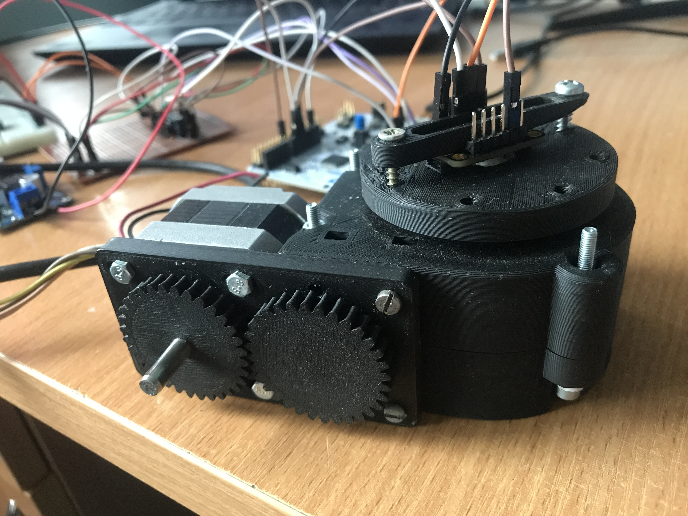

<!-- ABOUT THE PROJECT -->
## About The Project

There you have device which is leveling the indicator. Every time when you are trying to rotate this device the table get back to the levelled position.

(<a href="#top">back to top</a>)

